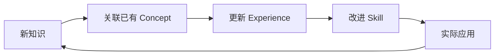

# Learning Cycle Implementation

> 学习循环实践方法论 — 从广度调研到深度沉淀的完整迭代框架

## 1. Breadth-First Survey 广度优先调研

### 调研范围界定

```markdown
# 新领域广度调研 4 步法

1. **知识地图构建** (30分钟)
   - 搜索领域关键词，浏览 Wikipedia / 权威文档目录
   - 识别核心子领域（5-7 个主要分支）
   - 记录关键术语和概念名称

2. **资源分级**
   | 层级 | 资源类型 | 投入时间 |
   |:-----|:---------|:---------|
   | S级 | 官方文档 / Paper Reviews | 全程深度 |
   | A级 | 高质量教程 / 技术博客 | 重点精读 |
   | B级 | 视频 / 论坛讨论 | 选择性快进 |
   | C级 | 社交媒体 / 新闻 | 仅扫标题 |

3. **T 型调研** — 广度优先 + 单一深度点
   - 横向: 了解所有子领域基本概念
   - 纵向: 选 1 个最核心/最需要部分深度到可实践

4. **知识结构输出**
   - 输出领域知识图谱（Mermaid / Markdown 列表）
   - 标记已知/未知/需要深入区域
```

### 问题驱动的调研

```markdown
# 用问题引导调研，避免信息过载
示例 - LLM Agent 领域：
- ❌ 「我要学 LLM Agent」→ 范围太大
- ✅ 「如何让 Agent 调用外部工具？」→ 聚焦 function calling
- ✅ 「多 Agent 如何避免上下文冲突？」→ 聚焦编排模式
```

## 2. Deep-Dive Iterations 深度迭代

### 深度迭代节奏

```markdown
# 45 分钟深度工作法
1. **聚焦** (5分钟): 回顾上一个迭代的终点
2. **实践** (25分钟): 代码 / 实验 / 笔记
3. **反思** (10分钟): 学到了什么？还有什么问题？
4. **记录** (5分钟): 沉淀关键洞察到知识库

# 3 次迭代原则
- 第 1 次: 复现/理解（照做）
- 第 2 次: 修改/组合（改造）
- 第 3 次: 创造/扩展（创新）
```

### 理解深度层次

| 层次 | 表现 | 检验方法 |
|:-----|:------|:---------|
| **L1 能解释** | 用自己的话描述概念 | Feynman 法：教给新手 |
| **L2 能使用** | 能按教程完成基本操作 | 写一个 Hello World |
| **L3 能调试** | 遇到错误能定位原因 | 故意制造错误再修复 |
| **L4 能优化** | 理解性能/质量权衡 | 对比不同方案优劣 |
| **L5 能创造** | 在领域内创新 | 提出新方法/工具 |

### 主动学习 vs 被动学习

```markdown
# 学习方式效率金字塔
被动学习（低效）:
  听讲      → 5%  留存
  阅读      → 10% 留存
  看演示    → 20% 留存

主动学习（高效）:
  讨论/实践  → 50% 留存
  教给别人   → 75% 留存
  立即应用   → 90% 留存
```

## 3. Skill Precipitation 技能沉淀

### 从经验到技能的转化

```markdown
# 技能沉淀工作流
实践发现有效模式
    ↓
记录为 Experience 文档
    ↓
提炼出通用步骤/规则
    ↓
封装为可复用的 Skill
    ↓
在类似场景中验证
    ↓
迭代优化 Skill 内容
```

### Skill 质量检查清单

```markdown
- [ ] 有明确的输入/输出定义
- [ ] 步骤可被另一 Agent 执行
- [ ] 包含示例（正面 + 反面）
- [ ] 有边界条件说明（何时不适用）
- [ ] 引用了相关 Experience 文档
- [ ] 版本号 + 变更记录
```

### 知识沉淀的粒度

```markdown
# 不同粒度的知识单元
Concept（概念）:
  是什么？→ KNOWLEDGE/concepts/
  
Experience（经验）:
  怎么做？→ EXPERIENCES/ 文档

Skill（技能）:
  如何复用？→ SKILLS/ 目录

Capability Pack（能力包）:
  如何整合？→ pack 根目录
```

## 4. Review Loops 复习循环

### 间隔重复复习策略

```markdown
# 复习时间表
第 1 次: 学习后 1 天
第 2 次: 学习后 3 天
第 3 次: 学习后 7 天
第 4 次: 学习后 21 天
第 5 次: 学习后 60 天

# 复习方法
- 主动回忆: 不看笔记回忆核心概念
- 应用测试: 尝试解决实际问题
- 教授他人: 写教程/做分享
- 交叉链接: 连接不同领域的知识
```

### 知识审计周期

```markdown
# 定期知识审计
每日: 回顾当天学到的一个关键洞察
每周: 整理本周沉淀的 Experience 和 Skill
每月: 体验知识库存，标记过时/需更新的内容
每季: 重新审视领域知识图谱，更新连接
```

### 知识关联与网络效应



## 5. 常见陷阱与对策

| 陷阱 | 表现 | 对策 |
|:-----|:------|:------|
| **信息过载** | 收藏无数资源从未看 | 限制调研时间，立即进入实践 |
| **教程依赖** | 只会跟着做不会自己搞 | 第 2 次迭代必须脱离教程 |
| **知识孤岛** | 学了很多但连不起来 | 每次学完画知识连接图 |
| **遗忘曲线** | 学完就忘 | 间隔重复 + 主动回忆 |
| **完美主义** | 等学「够」了才动手 | 先做最小可行实践 |
