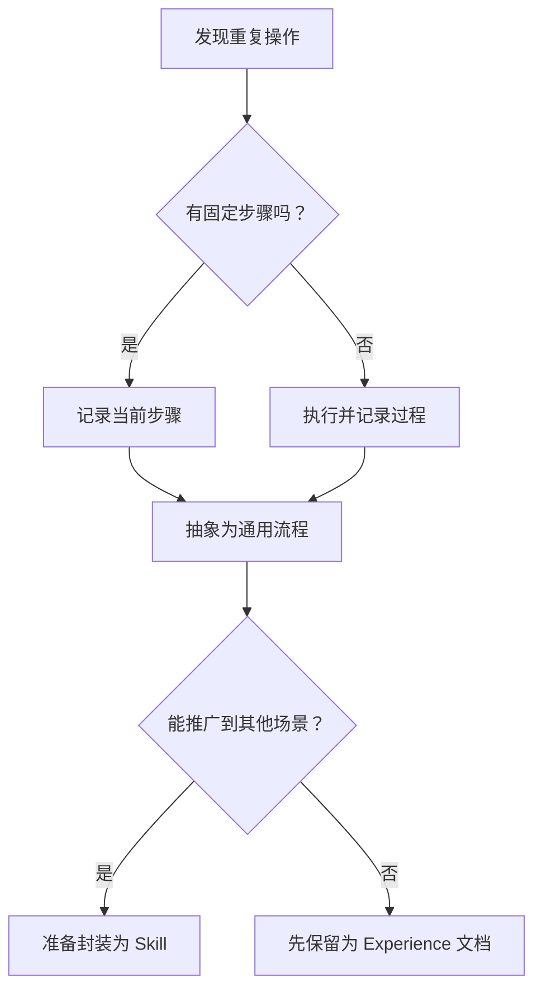

# Skill Extraction from Practical Experience

> 从实践经验中提取可复用技能的完整方法论 — 识别模式、记录过程、封装成 Skill

## 1. Identifying Patterns 识别模式

### 模式识别信号

```markdown
# 值得提取为 Skill 的信号
1. **重复操作** — 同一操作做了 3 次以上
   - 例：每次部署都要手动修改配置文件
   
2. **错误修复** — 遇到并解决了一个典型问题
   - 例：Docker 日志轮转配置出错，找到标准解法
   
3. **最佳实践** — 发现某件事有明确更好的做法
   - 例：对比了两种测试策略，确定某一种是普适较优的

4. **流程固化** — 某个多步骤流程可以标准化
   - 例：新项目初始化需要 8 步，可以写成 Skill
```

### 模式分析工作流



### 模式分类

| 模式类型 | 特征 | 适合 Skill? |
|:---------|:------|:------------|
| **流程型** | 步骤明确、顺序固定 | ✅ 非常适合 |
| **判断型** | 需要根据条件做选择 | ✅ 适合（含决策树） |
| **知识型** | 需要领域知识 | ⚠️ 适合（需确保知识完整） |
| **创意型** | 需要创造力 | ❌ 不适合（自由度太高） |
| **配置型** | 多参数组合 | ✅ 适合（模板化） |

## 2. Documenting Procedures 记录过程

### Experience 文档模板

```markdown
# 记录实用的 Experience 文档
---
type: <best-practice | tutorial | pitfall>
skill_ref: <关联 Skill 名称>
keywords: [相关标签]
---

# 标题

## 背景
什么场景下发现了这个经验？

## 详细步骤
1. 第一步（带代码/命令示例）
2. 第二步
3. 第三步

## 关键要点
- 最重要的注意事项
- 常见的坑

## 验证方法
如何确认操作成功

## 关联 Skill
指向 SKILLS/ 目录中的对应技能
```

### 记录粒度指南

```markdown
# 好的 Experience 记录
- ✅ 包含真实代码/命令片段
- ✅ 标明适用条件和限制
- ✅ 包含正反对比示例
- ✅ 给出可验证的输出检查方法
- ✅ 引用相关背景知识

# 差的 Experience 记录
- ❌ 只说「这样做不对」
- ❌ 没有具体命令/代码
- ❌ 没有说明「为什么」
- ❌ 大段无结构文本
- ❌ 只有理论没有实操
```

### 从日志到文档

```markdown
# 从工作日志提取 Experience
原始日志:
  "今天又遇到 Docker 日志爆满，删了 /var/lib/docker/containers 下的 json.log"

提取后:
  Docker 日志爆满处理方案
  1. 根本原因: 未配置 log rotation
  2. 临时解决: truncate 日志文件
  3. 长期方案: 配置 daemon.json 的 max-size/max-file
  4. 预防: 创建监控告警
```

## 3. Creating Reusable Skills 创建可复用技能

### Skill 结构设计

```markdown
# Skill 文件标准结构
SKILL.md
├── YAML Frontmatter
│   ├── name: 技能名称
│   ├── type: tool | knowledge | workflow
│   ├── version: semver 版本号
│   ├── description: 一句话描述
│   ├── tags: [分类标签]
│   └── dependencies: [引用的其他 Skill]
│
├── Purpose & Function
│   └── 技能目标和能力范围
│
├── Core Instructions
│   └── 可执行的步骤指令
│
├── Examples
│   ├── 正面示例（推荐做法）
│   └── 反面示例（常见错误）
│
├── References
│   └── 关联的 Experience / Concept 文档
│
└── Metadata
    ├── version history
    └── last validated
```

### Skill 开发 9 阶段流程

```markdown
# Skill 创建流水线（S1-S9）
S1. 识别需求 — 什么场景需要这个 Skill？
S2. 现有方案调研 — 有没有类似的 Skill/Experience？
S3. 设计 Skill 结构 — 确定 type 和 scope
S4. 编写核心指令 — 让 Agent 可执行的步骤
S5. 编写示例 — 至少 2 个正面 + 1 个反面
S6. 关联知识 — 链接 EXPERIENCES + CONCEPTS
S7. 质量检查 — SQS >= 50，依赖完整
S8. 部署 — skill_manage(action='create')
S9. 验证 — 在目标场景中测试
```

### 技能质量评估指标

```markdown
# Skill Quality Score (SQS) 维度
依赖完整性    - 引用的 Skill 必须存在且可用
指令清晰度    - 步骤是否有歧义，Agent 能否理解
示例覆盖率    - 示例是否覆盖常见和边界场景
知识关联度    - 是否有足够的 Experience 支撑
版本规范性    - 是否遵循 semver
元数据完整性  - name/description/tags 是否齐全
```

## 4. 从 Experience 到 Skill 的转化器

### 转化检查表

```markdown
# Experience → Skill 转化清单
□ 这个经验是否在 3 个以上场景出现过？
□ 步骤是否可以通用化（去除了具体路径/凭据）？
□ 有没有明确的『怎么知道做对了』的判断标准？
□ 是否需要决策分支？（需要 → 包含决策树）
□ 是否依赖其他 Skill？（需要 → 声明 dependencies）
□ 是否有对应的反面示例？

如果以上全部打勾 → 适合转化为 Skill
如果有 2 个以上未打勾 → 先保留为 Experience
```

### 转化示例

```markdown
Experience: Docker log rotation 配置
    ↓ 提取通用步骤
Skill: docker-log-rotation
    ↓ 使用
Agent 在发现 Docker 日志膨胀时自动调用该 Skill 配置日志策略
```

## 5. 常见陷阱

| 陷阱 | 现象 | 对策 |
|:-----|:------|:------|
| **过度封装** | 把一次性操作也写成 Skill | 3 次以上重复才值得封装 |
| **粒度失衡** | Skill 太大或太小 | 1 Skill 解决 1 个明确问题 |
| **缺少验证** | 不知道 Skill 是否有效 | 每个 Skill 包含验证步骤 |
| **依赖断裂** | Skill 引用已删除的 Skill | 定期运行 dependency-scan |
| **知识孤立** | Skill 没有关联文档 | 每个 Skill 必须有 References |
